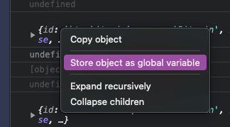

받아온 api object의 keys, values를 뽑아서 쉽게 복붙해서 만들자!

콘솔로 출력한 뒤,<br/>
`Store object as global variable` 항목을 클릭하면 `temp1` 이란 `object`가 생성됨



```typescript
Object.keys(temp1).join();

> "id,name,...";
```

모든 속성명 가져오기

```typescript
Object.values(temp1)
  .map((v) => typeof v)
  .join();

> "string,string,...";
```

모든 타입 가져오기

_단, object in array 같은 경우 그냥 object로 찍히기 때문에.. 확인하고 사용해야 한다!_
