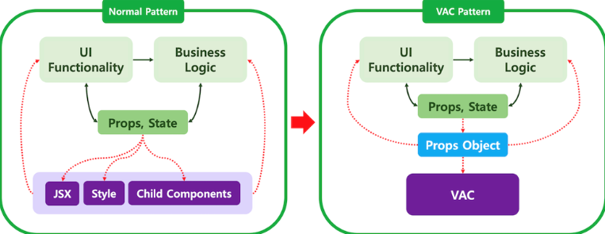

### 디자인 패턴

지금껏 React로 개발을 해오면서 다양한 디자인 패턴을 적용하고 활용해보면서
최근까지 거의 정착해오던 패턴이 `Container-Presenter`패턴이다.

컴포넌트 내부에 View기능과 비지니스 로직이 많아지면서 데이터 처리와 출력을 구분하여 관리할 필요성을 느꼈기 때문에 적용한 패턴이었다.

`props`를 한번 더 전달해야 하는 경우는 좀 불편하였고,
그 외의 부분에선 코드 가독성도 높아지고 *(프로젝트 후반부로 갈수록 규모가 커지고 복잡해지기 때문에 꽤 신경쓰는 부분!)* 협업단에서의 충돌도 많이 줄었기 때문에 굉장히 만족하며 쓰고있는 패턴이다.

---

### VAC Pattern

때문에 VAC패턴에 더욱 관심이 가서 알아보고 적용해보려한다.
지금 쓰고있는 `Container-Presenter`패턴과 비슷하지만, 좀 더 강력하게(?) 적극적으로 스타일과 로직을 분리하는 패턴이다.

