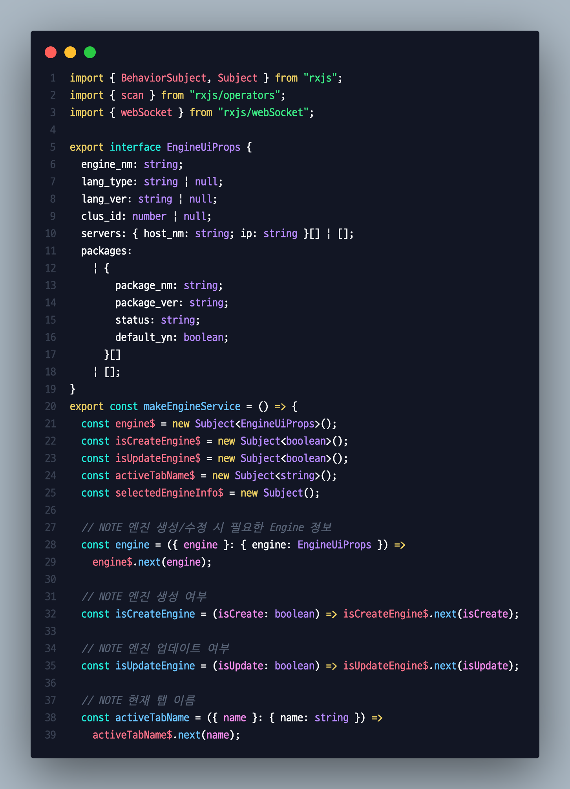

## Overview

**현 프로젝트 상태구조**
전역 상태 관리를 위해 `ContextAPI`를 사용하고 있으며,
로컬 상태는 각 컴포넌트에서 사용되는 상태만 각자(각 컴포넌트에서) 관리하고 있다.
프로젝트 규모가 커지면서, 컴포넌트에 로컬 상태과 비동기 통신이 혼재되고 복잡도가 높아지고 있다.
전역, 로컬, 서버 상태를 어떻게 구분하고 관리할지에 대한 설계가 필요하다고 판단되어 아래 내용을 제안합니다 🤜

> Local State: 리액트 컴포넌트 안에서만 사용되는 State<br />
> Global State: Global Store에 정의되어 프로젝트 어디서나 접근 가능한 State<br/>
> Server State: 서버로부터 받아오는 State

<!--truncate-->

## 현재 구조

**전역 상태**


**로컬상태**


## ✔️ 문제점

- BA처럼 복잡한 프로젝트의 경우 백여개의 api동작마다 모두 응답값을 바라보는 상태들이 존재하고 이러한 것들이 전역 상태와 컴포넌트 내부에 산재되어 있다.
- 추가로 api에서 받은 데이터의 조작과 가공된 상태까지 존재함에따라 상태관리의 복잡도가 증가되고 있다.
  이러한 방식이 유지되면 상태관리가 어렵고, 복잡도만 늘어갈 것으로 생각됩니다.

전역 상태와 비동기 통신에 따른 상태가 분리되야하고 각 컴포넌트 내부엔 client side의 상태만
관리될 필요성이 있다고 보여짐

## 🖍 해결 포인트

- 전역 상태 관리에서 비동기 통신을 걷어내야 함
- 서버 관련 상태를 별도로 관리하되 전역 상태로 활용될 수 있어야 함
- 컴포넌트 개별단위의 상태는 유지하되 마찬가지로 비동기 통신을 걷어내야 함

## 🧐 방안 제시

**React Query의 도입**

[React Query](https://react-query.tanstack.com/)란<br/>
: Server와 client 사이 비동기 로직을 쉽게 다루게 해주는 라이브러리

### React-query 특징&강점

1. 간결한 코드

- saga처럼 비동기 관련 로직이 장황하지 않음
- `useQuery`를 통해 고유한 key값으로 구분되며, 여러 쿼리를 컴포넌트 곳곳에 뿌려둬도 동일한 데이터에 접근 가능
- 코드 길이가 짧아지고 가독성도 좋음
- 상태 저장 필요없이 바로 사용 가능

```typescript
// React-query예시
const { data, isLoading, isError, ... } = useQuery("key", fetchFc, { ...options });

return (
  <ul>
    {data.map(item => (
      <li key={item.id}>{item.name}</li>
    ))}
  </ul>
)
```

2. 동기화 및 업데이트를 보다 쉽게 처리할 수 있음

## 결론/제안

Local State: 기존 방식 유지 (useState)<br />
Global State: Recoil, Mobx같이 전역관리용 라이브러리 써치 및 도입 필요<br/>
Server State: React query를 사용하여 로컬상태와 분리함

<!-- ## An exhibit of Markdown

_Note: Feel free to play with this page. Unlike regular notes, this doesn't automatically save itself._

## Basic formatting

Paragraphs can be written like so. A paragraph is the basic block of Markdown. A paragraph is what text will turn into when there is no reason it should become anything else.

Paragraphs must be separated by a blank line. Basic formatting of _italics_ and **bold** is supported. This _can be **nested** like_ so.

## Lists

### Ordered list

1. Item 1
2. A second item
3. Number 3
4. Ⅳ

_Note: the fourth item uses the Unicode character for [Roman numeral four][2]._

### Unordered list

- An item
- Another item
- Yet another item
- And there's more...

## Paragraph modifiers

### Code block

    Code blocks are very useful for developers and other people who look at code or other things that are written in plain text. As you can see, it uses a fixed-width font.

You can also make `inline code` to add code into other things.

### Quote

> Here is a quote. What this is should be self explanatory. Quotes are automatically indented when they are used.

## Headings

There are six levels of headings. They correspond with the six levels of HTML headings. You've probably noticed them already in the page. Each level down uses one more hash character.

### Headings _can_ also contain **formatting**

### They can even contain `inline code`

Of course, demonstrating what headings look like messes up the structure of the page.

I don't recommend using more than three or four levels of headings here, because, when you're smallest heading isn't too small, and you're largest heading isn't too big, and you want each size up to look noticeably larger and more important, there there are only so many sizes that you can use.

## URLs

URLs can be made in a handful of ways:

- A named link to [MarkItDown][3]. The easiest way to do these is to select what you want to make a link and hit `Ctrl+L`.
- Another named link to [MarkItDown](https://www.markitdown.net/)
- Sometimes you just want a URL like <https://www.markitdown.net/>.

## Horizontal rule

A horizontal rule is a line that goes across the middle of the page.

---

It's sometimes handy for breaking things up.

## Images

Markdown can also contain images. I'll need to add something here sometime.

## Finally

There's actually a lot more to Markdown than this. See the official [introduction][4] and [syntax][5] for more information. However, be aware that this is not using the official implementation, and this might work subtly differently in some of the little things.

[1]: https://daringfireball.net/projects/markdown/
[2]: https://www.fileformat.info/info/unicode/char/2163/index.htm
[3]: https://www.markitdown.net/
[4]: https://daringfireball.net/projects/markdown/basics
[5]: https://daringfireball.net/projects/markdown/syntax -->
